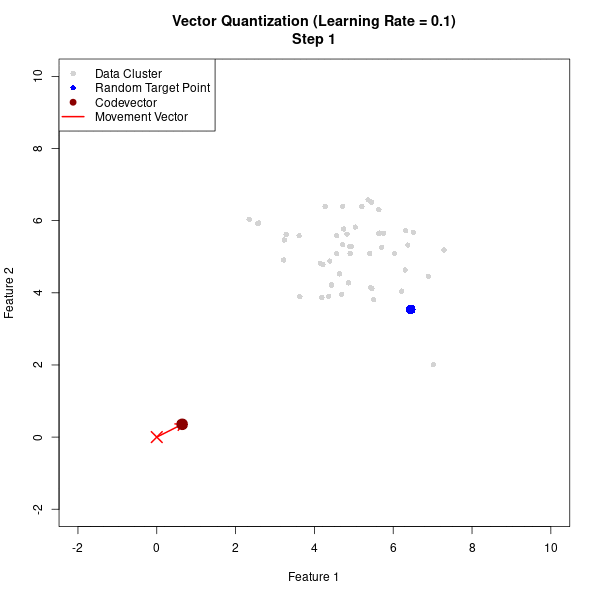
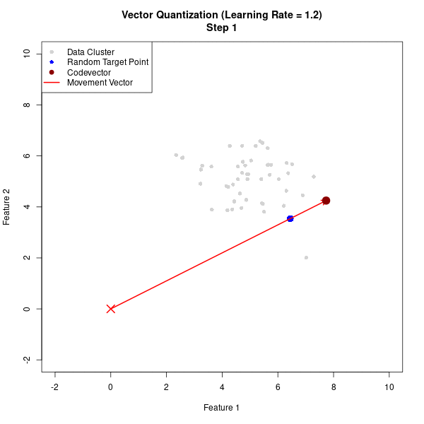

### Question 2
**What are the possible results of increasing the learning rate in a vector quantisation style algorithm?**

**Answer & Explanation:**
In vector quantization (like K-Means, SOMs, or Neural Gas), the **learning rate** ($\alpha$ or $\epsilon$) controls how far a codevector moves toward a target data point during each training step.

Increasing the learning rate has the following possible results:

* **Faster Initial Movement:** At the very beginning of training, a higher learning rate helps codevectors travel quickly from their random starting positions toward the data clusters.
* **Overshooting & Oscillation:** If the learning rate is too high, the codevector will take steps that are too large. Instead of settling into the center of a data cluster, it will shoot past the optimal point. It will then continuously bounce back and forth (oscillate) around the target without ever stabilizing.
* **Higher Final Quantisation Error:** Because the vectors are oscillating and cannot finely adjust their positions to sit exactly in the center of the clusters, the overall distance between the data points and their assigned codevectors remains higher than necessary.

**Visualizing the Impact of Learning Rate:**

Here is a visual comparison of an optimal learning rate versus a learning rate that has been set too high.

*Optimal Learning Rate ($\alpha = 0.1$): The codevector smoothly converges into the center of the data.*

*High Learning Rate ($\alpha = 1.2$): The codevector overshoots the target points and violently oscillates, failing to converge.*
