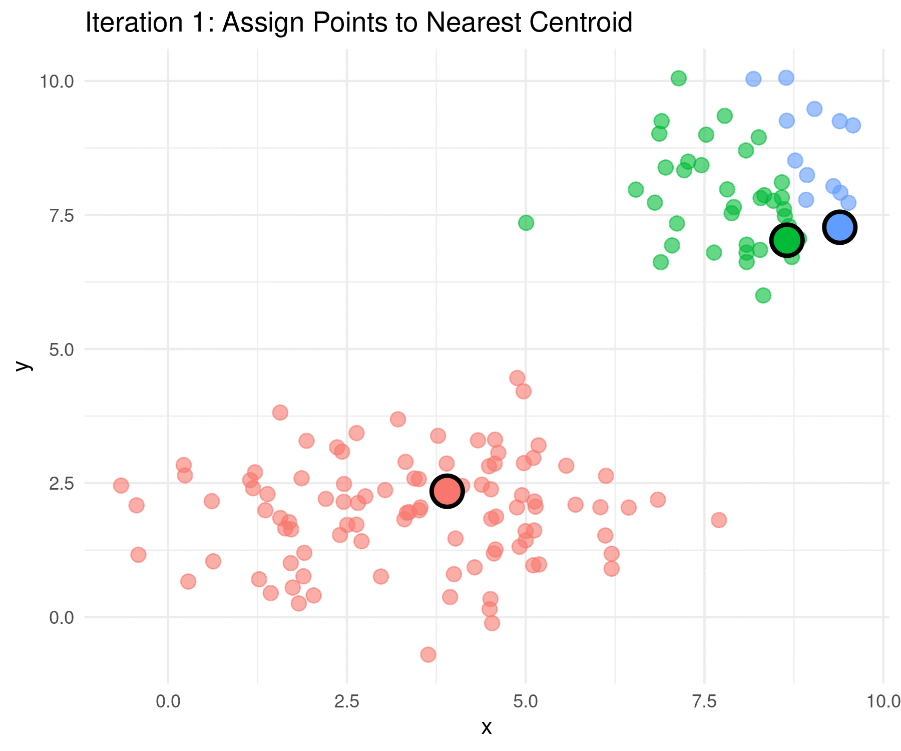
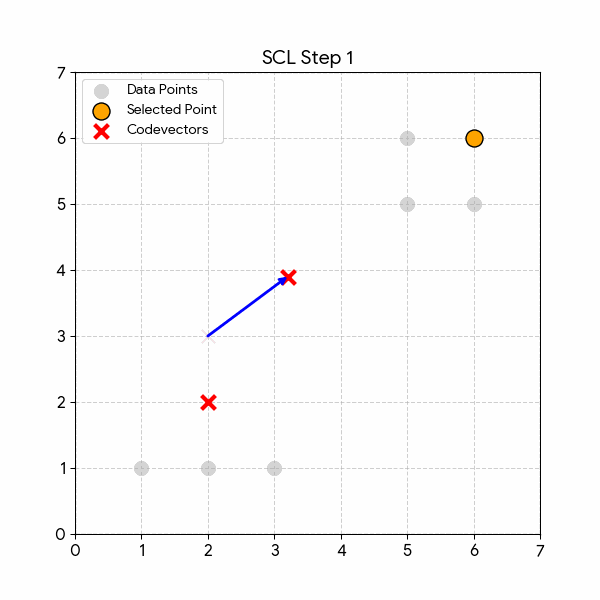
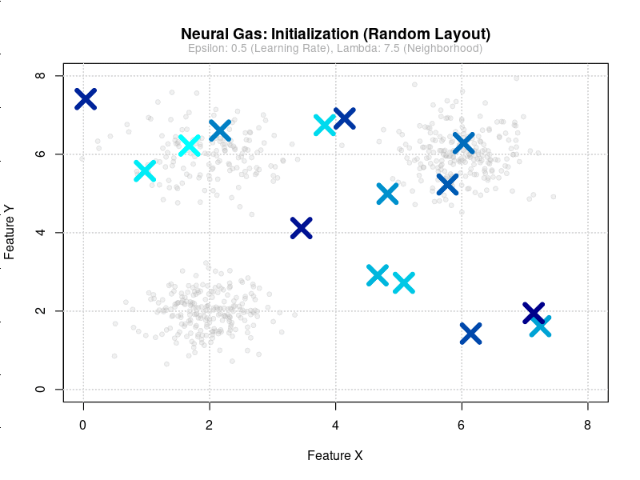
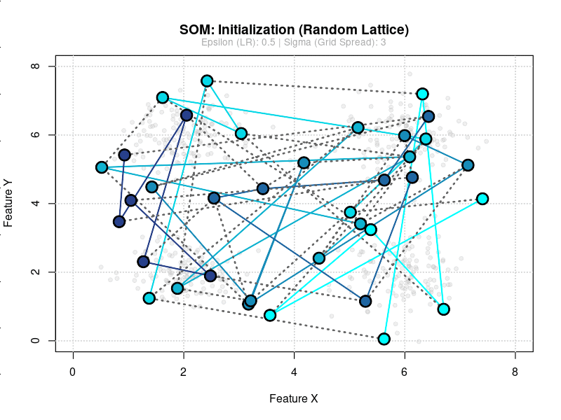

# Unit 2: Unsupervised Learning - Vector Quantisation

## Data suitable for unsupervised learning

Unsupervised learning uses **unlabelled data**: only input values, without the target/output labels used in supervised learning. It is suited to discovering structure, clusters, and representations when labels are unavailable or expensive.

## Vector quantisation

Vector quantisation is a technique that reduces data **complexity** by finding patterns and structure. It can be applied to numerical, categorical, spatial, and geographical data, and to some unstructured patterns in text and images. It provides:

- **Representation** of data with minimised representation error
- **Evenly spaced** representation (reduction of sampling bias)
- **Discovery** of clusters or graph structures

## Algorithms for vector quantisation

### K-Means clustering

Clustering groups data by similarity. **K-means** builds $k$ clusters, each represented by a **centroid** (the mean of the points in that cluster).

- **Cluster representation:** Each cluster is represented by the mean (centroid) of the data points assigned to it.
- **Assignment:** Each data point is assigned to the cluster whose centroid is closest, usually by **Euclidean distance** $d(\mathbf{x}, \mathbf{c}) = \|\mathbf{x} - \mathbf{c}\|$.
- **Iterative optimisation:** Centroids and assignments are updated repeatedly until convergence, minimising the within-cluster sum of squared distances.
- **Compression:** After k-means, the data can be stored compactly as the $k$ centroids plus the assignment of each point to a centroid.

### Simple competitive learning

**Simple competitive learning (SCL)** uses units (e.g. neurons) that **compete** to become the “winner” (most activated) for each input.

**Example — anomaly detection:** Banks use competitive learning on normal transaction data; inputs that do not match the learned prototypes well are flagged as suspicious or fraudulent.

### Neural gas

**Neural gas** algorithms grow or adapt a set of **nodes** that represent the data distribution.

Common uses: point clouds and meshes from 3D scans, spatial mapping, and data compression when the data are non-uniform.

### Self-organising maps (SOMs)

SOMs build a **grid of nodes** that preserves neighbourhood structure in the input space.

Typical applications: market analysis, bioinformatics, text mining, and document organisation.
