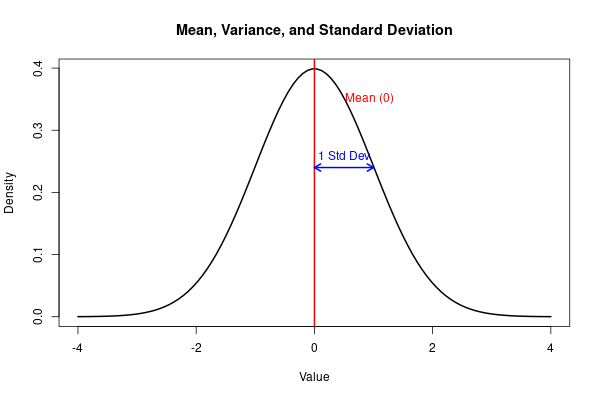
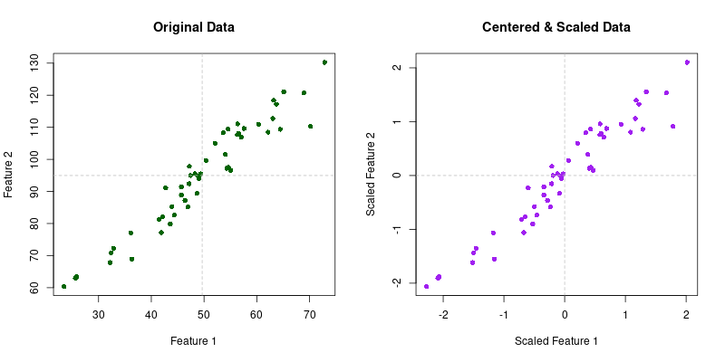
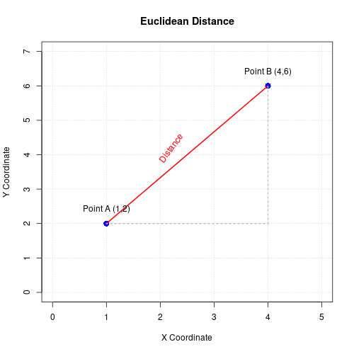
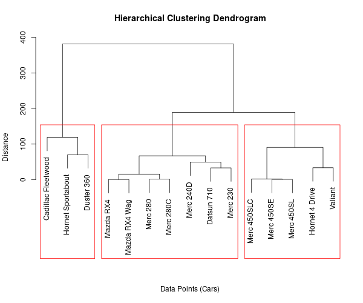
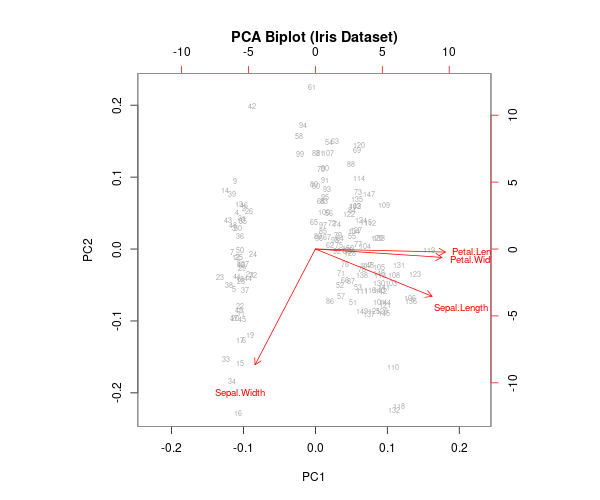
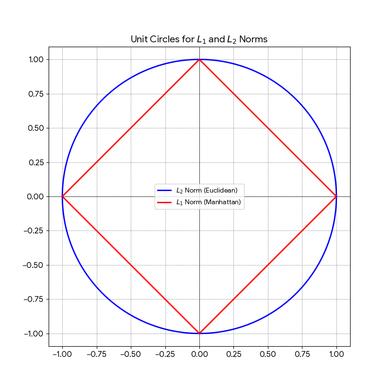
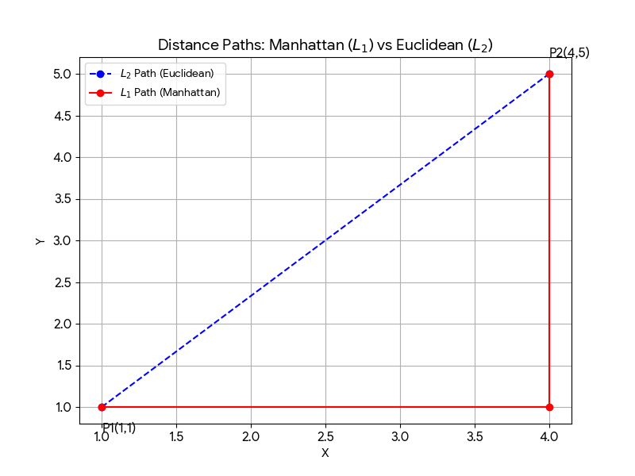

# Unit 3: Unsupervised Learning - Hierarchical Clustering and Principal Component Analysis

**Learning Objectives:**
* Perform essential data preprocessing and statistical analysis to prepare and understand datasets for machine learning applications.
* Organise and interpret data hierarchies, and gain insights into natural groupings and relationships within complex datasets with hierarchical clustering.
* Use Principal Component Analysis (PCA) to reduce dimensionality, uncover essential patterns, and represent and analyse complex datasets effectively.

## Data Preprocessing
Data preprocessing involves preparing data to enhance its quality and structure before it is used in machine learning algorithms. There are several statistical tools and transformations used to help with this.

### Mean, Variance, and Standard Deviation
* **Mean:** The average value of the data.
* **Variance:** The spread or dispersion of the data points around the mean.
* **Standard Deviation:** The square root of the variance.

**Purpose:** These metrics help us understand the central tendency and the variability of the data. They are crucial for understanding the distribution of individual features.

### Centering and Scaling (Unit Variance)
* **Centering:** Subtracting the mean from every data point (so the new mean is 0).
* **Scaling:** Dividing the centered data by the standard deviation (so the new standard deviation is 1).

**Purpose:** Data is often recorded using arbitrary coordinate systems or varying units of measurement (e.g., mixing kilograms and millimeters). Centering and scaling standardize the origin and scale, ensuring that features with larger ranges do not disproportionately dominate the machine learning model.

### Distances
Distance metrics measure the similarity and dissimilarity between data points.

**Purpose:** Calculating distance is a fundamental mathematical step for clustering algorithms and other unsupervised techniques. The most common metric is the **Euclidean distance**, which measures the straight-line distance between two points: $d = \sqrt{(x_2 - x_1)^2 + (y_2 - y_1)^2}$.

---

## Hierarchical Clustering
Hierarchical clustering is a method of cluster analysis that builds a tree-like structure of the data, known as a **dendrogram**. The branches in the tree represent steps or groupings based on specific feature distances. 

**Common Uses:** Biological taxonomy, document classification, and customer segmentation.

---

## Principal Component Analysis (PCA)
PCA is a technique that reduces the dimensionality (number of features) of a dataset while retaining the maximum possible variance. It achieves this by identifying the "principal components"—new, uncorrelated variables that are the most descriptive and capture the underlying structure of the data.

**Common Uses:** Image compression, financial modeling, and genomics.

## Vector Norms
### The $L_1$ Norm (Manhattan Distance)

Formula: $||x||_1 = \sum |x_i|$ 

Geometry: The unit circle is a diamond shape. 

Intuition: Imagine walking in a city like Manhattan where you can only move along a grid (streets and avenues). You cannot cut through buildings diagonally. 

Application: Used in Lasso Regression because it tends to produce "sparse" solutions (setting some coefficients exactly to zero).

### The $L_2$ Norm (Euclidean Distance)

Formula: $||x||_2 = \sqrt{\sum x_i^2}$ 

Geometry: The unit circle is a perfect circle. 

Intuition: This is "as the crow flies"—the shortest straight-line distance between two points.

Application: Used in Ridge Regression and most standard geometric calculations. It is sensitive to outliers because it squares the error.

