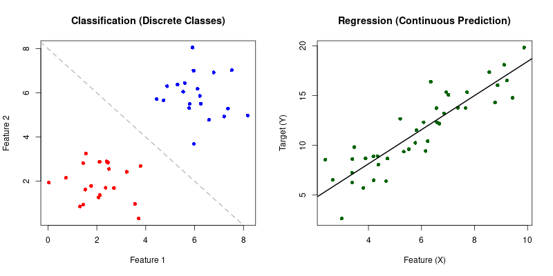
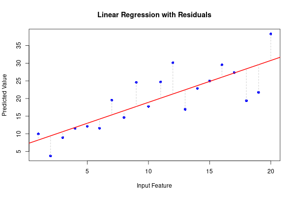
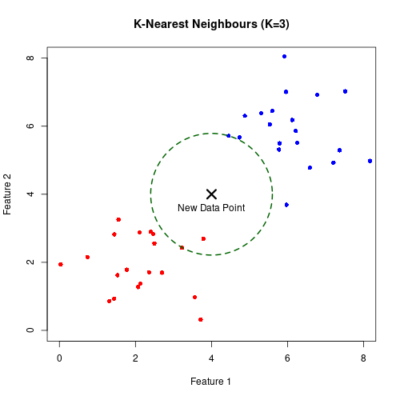
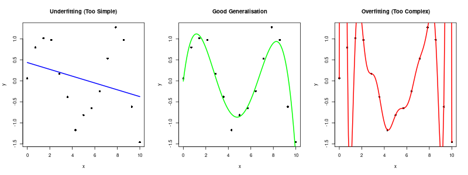
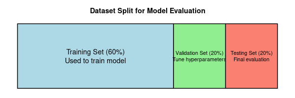

# Unit 4: Supervised Learning - Linear Models, K-Nearest Neighbours, Principles, Limitations, and Validation

**Learning Objectives:**
* Understand and apply the principles of linear models and K-Nearest Neighbours (KNN) for analysis.
* Describe the significance of distributions and Bayes error rate.
* Identify challenges posed by high-dimensional spaces.
* Apply basic analyses to characterise model performance, and distinguish between overfitting and generalisation.

---

## Core Machine Learning Tasks
Supervised learning typically falls into one of two main categories depending on the output we want to predict.

* **Classification:** Training a model to categorize input data into discrete classes. 
    * *Examples:* Spam detection (binary classification: spam or not spam), or identifying species of flowers (multiclass classification).
* **Regression:** Training a model to predict continuous numerical values based on input data.
    * *Examples:* Predicting house prices based on square footage, or temperature prediction using historical weather data.

[Image of classification vs regression machine learning]

---

## Model Types and Assumptions

### Parametric vs. Non-Parametric Models
* **Parametric Models:** These make explicit assumptions about the underlying form or distribution of the data (e.g., assuming a linear relationship). They have a fixed number of parameters.
* **Non-Parametric Models:** These make fewer assumptions about the data's distribution. The complexity of the model can grow as the amount of training data increases.

### Linear Models
A general term for models that assume a linear relationship between the input features and the output. These are parametric models.
* **Linear Regression:** Used for predicting a continuous outcome variable by fitting a line (or plane) of best fit through the data points.
* **Linear Classification:** Models (like Logistic Regression or Support Vector Machines) that separate different classes using a straight line or a higher-dimensional flat surface called a **hyperplane**.

### K-Nearest Neighbours (KNN)
KNN is a non-parametric model used for both regression and classification. It classifies a new data point based on the majority class of its 'K' closest neighbors in the training data.
* *Common Uses:* Image recognition, medical diagnosis, and recommendation systems.

---

## Model Performance and Validation

### Generalisation vs. Overfitting
* **Generalisation:** The ability of a machine learning model to make accurate predictions on new, unseen input data that it was not trained on.
* **Overfitting:** When a model learns the training data *too* well, including its noise and outliers, resulting in poor performance on unseen data.

### Model Evaluation Techniques
To ensure a model generalizes well, we split our data:
* **Training-Validation-Testing Split:** * **Training Set:** Used to train the model.
    * **Validation Set:** Used to evaluate the model during training and select the best hyperparameters.
    * **Testing Set:** A completely held-out dataset used only at the very end to evaluate the final model's performance.
* **Cross-Validation:** A more robust technique where the data is divided into multiple subsets (folds). The model is trained and evaluated multiple times, rotating which subset is used for testing. This evaluates model performance on data not used in training.

> **What is a hyperparameter?** > A hyperparameter is a configuration setting that the data scientist sets *before* training begins to control the learning process. Unlike standard parameters (like the slope in linear regression, which the model learns on its own), hyperparameters must be tuned manually. For example, the number of neighbors ('K') in KNN is a hyperparameter.

---

## Statistical Foundations and Challenges

* **Joint and Marginal Distribution:** The foundation of statistical modeling. The joint distribution looks at the probability of two or more events happening simultaneously, while the marginal distribution looks at the probability of an event happening regardless of the others. These help us understand complex relationships between features.
* **Bayes Error Rate:** The lowest possible error rate for any classifier on a given dataset. It represents the inherent noise in the data itself and serves as an aspirational benchmark. No model can achieve an error rate lower than the Bayes error rate without overfitting.
* **The Curse of Dimensionality:** As the number of dimensions (features) in a dataset increases, the volume of the space increases so fast that the available training data becomes sparse. The density of training points decreases exponentially. Dimensionality reduction (like PCA from Unit 3) mitigates these challenges.