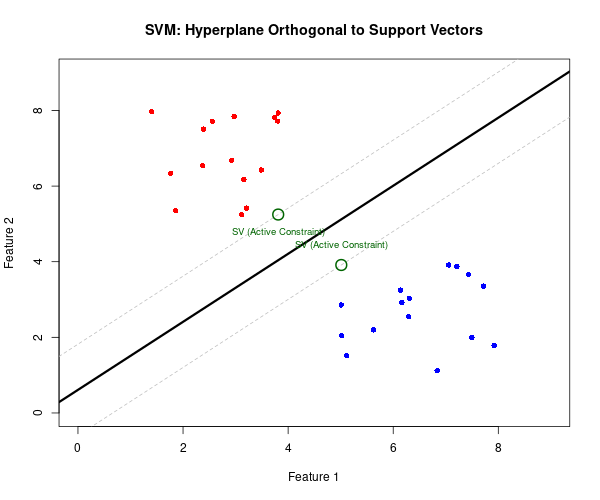
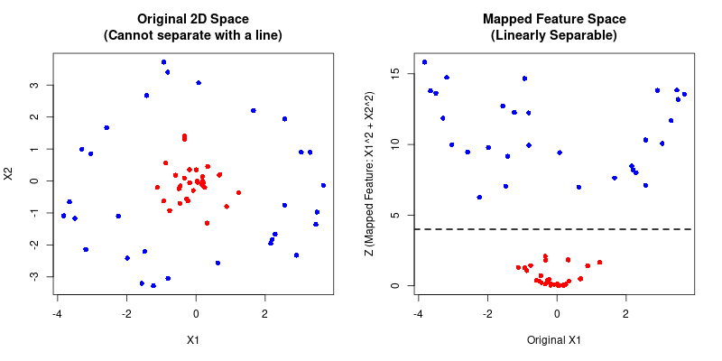

# Unit 5: Supervised Learning - Support Vector Machines

**Learning Objectives:**
* Understand the role of Lagrange Multipliers and Karush-Kuhn-Tucker in optimising SVMs.
* Grasp the concept of Maximum Margin Classification and its significance in SVMs.
* Describe nonlinear SVM classification using inner product kernels and its applications.

---

## An Overview of SVMs
Support Vector Machines (SVMs) are supervised learning models used for classification and regression. In their basic form, they are linear classifiers based on the principle of **margin maximization**. The goal is to find a flat boundary (a hyperplane) that best separates different classes of data.

## Maximum Margin Classification
The fundamental concept of a linear SVM is finding the **Maximum Margin Hyperplane**. 
* **The Margin:** The empty space or "street" between the closest data points of different classes.
* **Support Vectors:** The specific data points that lie exactly on the edge of this margin. They are called "support" vectors because they literally support or define the location of the margin and the hyperplane. 

The algorithm aims to find the boundary that maximizes the distance between these closest data points, providing the most robust generalization for future data.

---

## The Mathematics of Optimization

To find this maximum margin, SVMs rely on constrained optimization techniques.

### Lagrange Multipliers
A mathematical strategy used to find the local maxima and minima of a function subject to **equality constraints**. In the context of SVMs, we want to maximize the margin while constraining the model to correctly classify the training data.

### Karush-Kuhn-Tucker (KKT) Conditions
The KKT conditions generalize the method of Lagrange multipliers to allow for **inequality constraints**. Since we want our data points to fall strictly *on or outside* the margin boundaries (e.g., $y_i(\mathbf{w} \cdot \mathbf{x}_i + b) \ge 1$), KKT conditions are the mathematical engine that solves the SVM optimization problem.

---

## Nonlinear SVMs and Kernels

Real-world data is rarely perfectly separable by a straight line or flat plane. 

### The Kernel Trick
To solve complex problems without linear separation, SVMs use **Inner Product Kernels**. A kernel is a mathematical function that measures the similarity between pairs of input data points and implicitly maps them into a higher-dimensional space. 

By mapping the data into a higher dimension (e.g., turning a 2D plane into a 3D space), data that was tangled together can become linearly separable by a flat hyperplane. When mapped back to the original dimension, this flat boundary appears as a complex, non-linear curve.

### Hyperparameter Selection
When training an SVM, tuning hyperparameters is essential:
* **Kernel Choice:** Selecting the type of mapping (e.g., Linear, Polynomial, Radial Basis Function / RBF).
* **C Parameter:** Controls the trade-off between maximizing the margin and minimizing classification errors on the training set (Soft Margin vs. Hard Margin).
* **Gamma ($\gamma$):** Used in the RBF kernel, it determines the influence of a single training example.