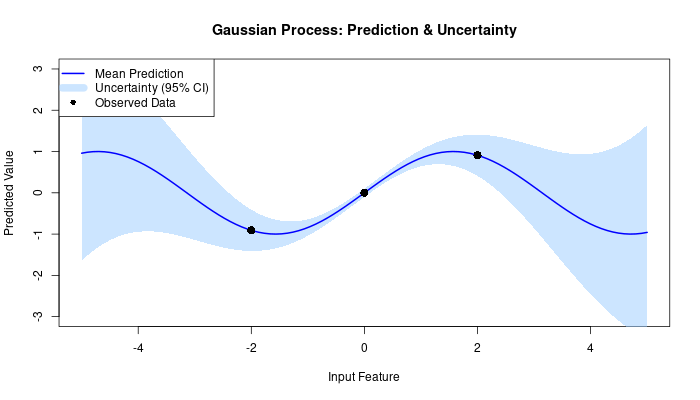
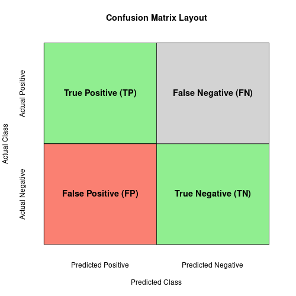
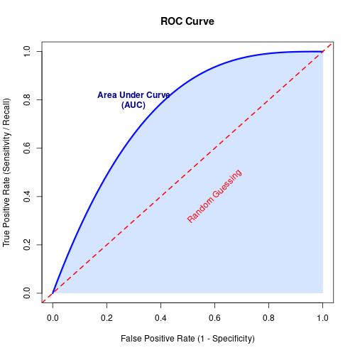
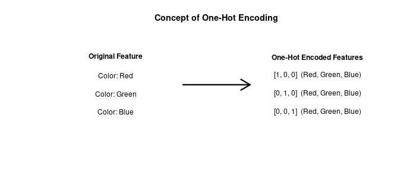

# Unit 6: Supervised Learning - Gaussian Processes, Measuring Model Performance, Reproducibility and Data Handling

**Learning Objectives:**
* Understand the concept of Gaussian Processes and their application in supervised learning.
* Identify various methods for measuring model performance beyond accuracy.
* Explore techniques for reproducible machine learning and data handling.

---

## Gaussian Processes
A Gaussian Process (GP) is a powerful, non-parametric Bayesian approach to regression and classification. 

**What is a Random Variable in this context?**
Normally, in machine learning (like linear regression), we try to find *one* specific line of best fit. A Gaussian Process is different: it defines a distribution over a virtually infinite number of *possible* functions that could fit the data. 
In probability, a **random variable** is a variable whose possible values are numerical outcomes of a random phenomenon. In a GP, any specific point you want to predict is treated as a random variable with a normal (Gaussian) distribution. This means a GP doesn't just give you a single prediction; it gives you a prediction *and* a measure of uncertainty (a confidence interval) for that prediction.

---

## Measuring Model Performance
There are many ways to compare classifiers. Relying solely on accuracy can be misleading, especially if your dataset is imbalanced (e.g., detecting a rare disease).

* **Accuracy:** How generally correct the model is. (Total correct predictions / Total predictions).
* **Precision:** Out of all the positive predictions the model made, how many were *actually* positive? (True Positives / All Predicted Positives).
* **Recall (Sensitivity):** Out of all the *actual* positive cases in the data, how many did the model successfully find? (True Positives / All Actual Positives).
* **F1-Score:** The harmonic mean of precision and recall. It is used when you need to balance the two metrics. The formula is: $F_1 = 2 \times \frac{\text{Precision} \times \text{Recall}}{\text{Precision} + \text{Recall}}$

---

## Receiver-Operating-Characteristic (ROC) Curve and AUC
The ROC curve is a graph that plots the performance of a classification model at all classification thresholds. 
* It plots the **True Positive Rate (Recall)** against the **False Positive Rate**.
* It shows the model's ability to achieve high sensitivity and specificity simultaneously.
* **AUC (Area Under the Curve):** Measures the entire two-dimensional area underneath the entire ROC curve. An AUC of 1.0 means perfect classification, while an AUC of 0.5 means the model is just guessing randomly.

---

## Multi-Class Classification and One-Hot Encoding
Many machine learning algorithms cannot work with categorical text data (like "Red", "Green", "Blue") directly; they require numbers.

* **One-Hot Encoding:** The process of converting categories into a binary matrix where each column represents a single category. A **1** indicates the presence of that category, and a **0** indicates its absence.
* **Benefits:** Training data becomes mathematically usable and expressive without implying any false numerical order or hierarchy (e.g., preventing the model from thinking "Blue" (3) is greater than "Red" (1)). It can also be rescaled easily.

---

## Reproducible Machine Learning and Computing
Reproducibility is the ability for you (or another researcher) to perfectly recreate the results of an experiment. 
* It includes carefully documenting the code, the specific training/testing data splits, the hyperparameter settings, the software versions, and setting a "random seed" so that random processes generate the exact same numbers every time the script is run.