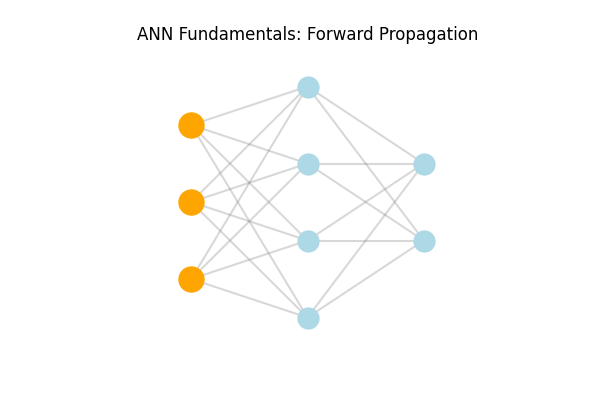
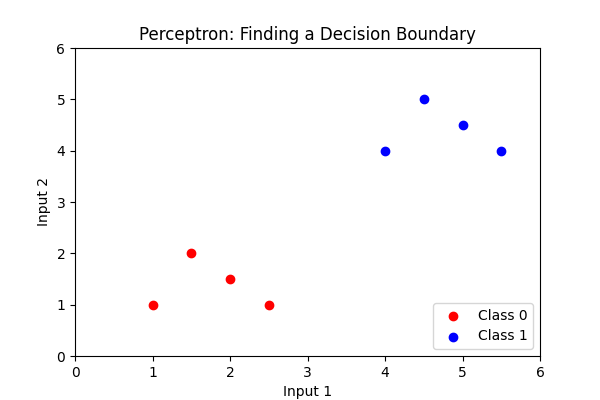
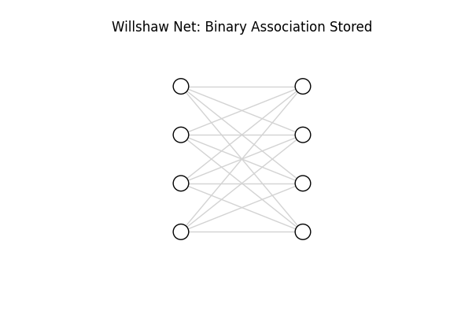
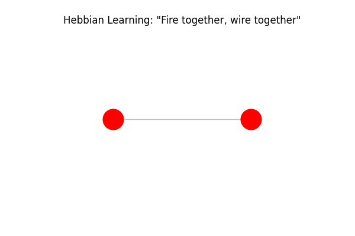
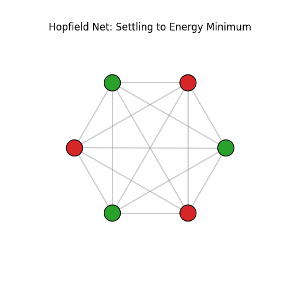

# Unit 7: Neural Networks - Artificial Neural Networks

## Learning Objectives
* **Understand** the fundamental concepts of artificial neural networks (ANNs) and their components.
* **Define** the basic principles behind perceptrons and their role in early neural network models.
* **Describe** specific types of neural networks, including Willshaw Nets, Hebbian Learning, and Hopfield Networks.

## ANN Fundamentals
Artificial Neural Networks (ANNs) are computational models inspired by the biological neural networks of animal brains. They consist of interconnected nodes (artificial neurons) organized into layers: an input layer, one or more hidden layers, and an output layer. Signals travel from the input layer through the network, with each connection applying a specific "weight" to the signal. An activation function determines whether a neuron fires based on the sum of its inputs, allowing the network to learn complex, non-linear patterns.

## Perceptrons
Perceptrons are the fundamental building blocks of neural networks and represent one of the earliest models of a biological neuron. A single-layer perceptron takes multiple inputs, multiplies them by learned weights, sums them up, and passes the result through a step function to produce a binary output (e.g., 0 or 1). While foundational, a basic perceptron can only solve linearly separable problems (problems where a straight line can separate the classes).

## Willshaw Nets
Willshaw Networks are a type of associative memory network. Unlike models that use continuous, variable weights, Willshaw nets use binary weights (connections are either 0 or 1) and binary inputs/outputs. They store associations between patterns by simply turning "on" the connection between active input and output neurons. They are highly efficient for storing sparse patterns (where most neurons are inactive at any given time).

## Hebbian Learning
Hebbian learning is a neuroscientific theory often summarized as: *"Cells that fire together, wire together."* In the context of ANNs, it is an unsupervised learning rule where the weight of the connection between two neurons is increased if they activate simultaneously. Mathematically, the weight update is proportional to the product of their activations: $\Delta w = \eta x y$. It forms the basis for how networks can learn associations without explicit error feedback.

## Hopfield Networks
A Hopfield Network is a type of fully connected, recurrent neural network where every neuron is connected to every other neuron (except itself). They act as content-addressable memory systems. When a Hopfield network is given a noisy or incomplete pattern, it updates its states iteratively to minimize its "energy," eventually settling into a stable state that corresponds to the closest memorized pattern.

