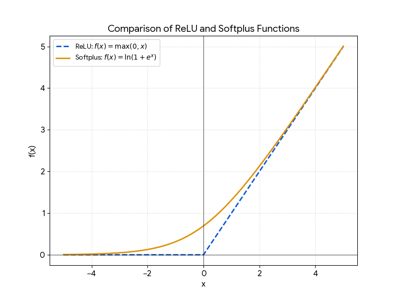

# Task 3
The softplus function is also known as the “smooth ReLU” function. Give an explanation of this name.
(Hint: generate a plot of the function and compare it to a plot of the standard ReLU function.)

# Solution
The name **"Smooth ReLU"** comes from the fact that the Softplus function acts as a mathematically "well-behaved" version of the standard **ReLU (Rectified Linear Unit)** activation function.

While they look nearly identical at a distance, their behavior at the "bend" is what sets them apart. Here is the breakdown of why this name is so fitting:

### The Shape Comparison

If you plot both functions, you’ll notice they share the same general trajectory:

* **For $x \ll 0$ (Large negative values):** Both functions approach **0**.
* **For $x \gg 0$ (Large positive values):** Both functions approach the line **$y = x$**.

### 2. The "Smooth" Factor (Differentiability)

The key difference lies at the origin ($x = 0$):

* **ReLU ($f(x) = \max(0, x)$):** Has a sharp, instantaneous change in direction at zero. Mathematically, this is a "kink," meaning the function is **not differentiable** at exactly $x = 0$.
* **Softplus ($f(x) = \ln(1 + e^x)$):** Curvatures gently through the origin. It is **continuously differentiable** everywhere. In optimization (like training a neural network), having a smooth gradient can sometimes make the math more stable.

### 3. Summary Table

| Feature | ReLU | Softplus (Smooth ReLU) |
| --- | --- | --- |
| **Formula** | $\max(0, x)$ | $\ln(1 + e^x)$ |
| **At $x = 0$** | Sharp angle (Corner) | Smooth curve |
| **Differentiable?** | No, not at $x=0$ | **Yes**, everywhere |
| **Derivative** | Step function (0 or 1) | Sigmoid function $\frac{1}{1 + e^{-x}}$ |

---

### Why does this matter in Deep Learning?

By using Softplus, you get the benefits of ReLU (ignoring negative noise and passing through positive signals) without the mathematical headache of a non-differentiable point at zero. However, in practice, standard ReLU is often preferred because it is computationally faster to calculate!
